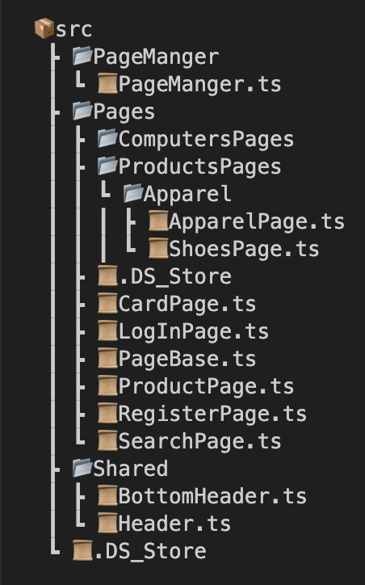

# E-commerce Automation Framework

Welcome to the E-commerce Automation Framework, designed specifically for nopCommerce, utilizing Playwright (TypeScript).

This framework aims to streamline and automate various processes within the [nopcommerce](https://demo.nopcommerce.com/) platform, enhancing efficiency and productivity for developers and testers alike. With Playwright's robust capabilities and TypeScript's flexibility, this framework offers a powerful solution for automating e-commerce workflows.

## Page Object Model (POM) File Tree

The Image above represents the file tree for the Page Object Model (POM) implemented in this framework. It provides a structured approach to organizing and managing web elements and actions within the automation framework.

Test Cases:
1- Register
2- Login
3- Search For Proudect
4- Add a Proudect to (card, wishlist, Compare list, email friend)
5- Add shoes(pick size, color, print)
6- Checkout

